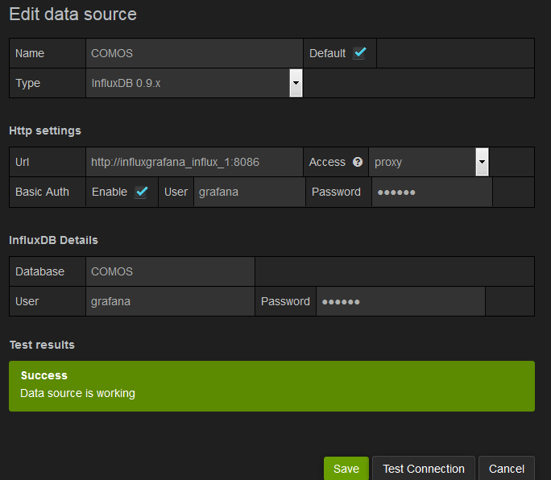
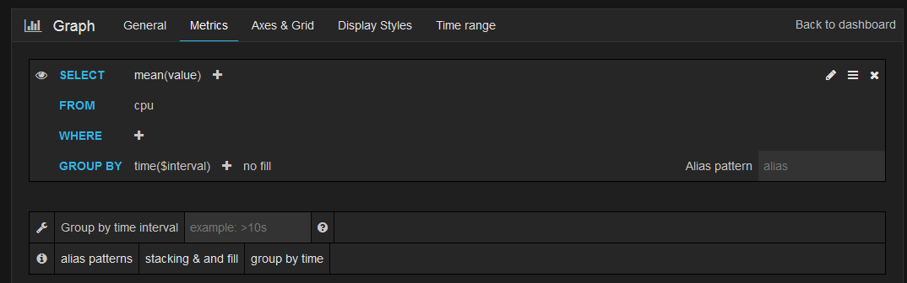

# Setup and Admin
The following instructions are specifically for my usecase, which is to report usage and performance values for an instance of Siemen's Comos application. This application has one central database that is accessed via a handful of Citrix terminal servers from users all over the world.  The goal is that Comos instances running on the Citrix servers will report **events** to an *influxDB* instance.  The Comos adminstrators can access the influxDB data via *Grafana*.

This document details the steps needed to deploy the *influxDB* and *Grafana* instances.  Adapting the Comos application to report events is out of the scope of this document.

## Installation and Startup
*InfluxDB* and *Grafana* will be deployed as*Docker* containers. This guide and supporting scripts are set up for a single server installation on Ubuntu 14.04 LTS.  It is possible to use other Linux distributions and/or separate servers for the *influxDB* and *Grafana* containers but changes will be needed.
* **Multiple Servers:** Look in the *docker-compose* setup to configure multiple servers
* **Other Linux distros:** Adapt the *install.sh* script accordingly  

Let's get started:

1. Start with a fresh install of Ubuntu 14.04 LTS

2. Ensure that *git* and *curl* are installed

3. From your user's home directory, clone the git repository: `git clone https://github.com/jmedding/influx_grafana.git`

4. `cd influx_grafana`

5. `sudo bash install.sh`

6.  Note the server's ip address with `ifconfig`.  Check the setting for *ETH0*. If you have `inet addr:10.0.4.23` then your server's \<ip address> is *10.0.4.23*.  

7. `sudo docker-compose up`

8. Using a web browser goto *\<ip address>:8083*. You should see the influxDB web console. You can now access *influxDB* as an Admin as there are no access rights configured yet.

9. Using a web browser goto *\<ip address>:3000*. You should see the *Grafana* login page. You can login as *admin:admin*.

### If you are using a VM on your local machine (like for development).

  * The \<ip address> returned by `ifconfig` will be the ip address inside the the VM. Use this to setup port forwarding in your VM
  * In the VM network settings add port forwarding rules like so
   * HostIP  => 127.0.0.1:3000
   * GuestIP => \<ip address>:3000
  * Repeat for ports 8083 and 8086

## Create a database for Comos data
1. Access the *influxDB* web console on port 8083 of the *influxDB* server.

2. In the **Query** box, enter `CREATE DATABASE COMOS`

3. Check that the response is positive

## Configure User Authentication and Authorization for *influxDB*

1. Access the *influxDB* web console on port 8083 of the *influxDB* server.

2. Create an Admin user

`CREATE USER "username" WITH PASSWORD 'password' WITH ALL PRIVILEGES`

3. Enable authentication in the influxDB config.toml file by setting `auth-enabled = true` in the `[http]` section.

4. Stop the docker containers with `sudo docker-compose stop` (or ctrl+c) and the rebuild the influx image with `sudo docker-compose build influx`. Restart the containers with `sudo docker-compose up`

5. Create the needed users for the COMOS database
  * **citrix** will write comos app data to influxDB
    *`CREATE USER "citrix" WITH PASSWORD 'alstom'`     
  * **grafana** will read data from influxDB and present it to the users
    *`CREATE USER "grafana" WITH PASSWORD 'alstom'` 

6. Grant the needed privileges to the new users
  * `GRANT WRITE on COMOS to citrix`
  * `GRANT READ on COMOS to grafana`

## Testing
### Create some Test Data
Simulate a Comos terminal server by using the `curl` command.

`curl -i -XPOST 'http://localhost:8086/write?db=COMOS&u=citrix&p=alstom' --data-binary 'cpu,host=server01,region=us-west value=0.64'`

Make sure you use the correct ipaddres and run the command several times over 5 minutes, changing some of the values.  The server should sent a *204 no content* response if the transfer was succesful.

### Configure Grafana

*Grafana* will query data from *infulxDB* over port 8086. The *proxy* method will be used. This means that Grafana will display the dashboard to the user via html.  When a user makes a request, it will be sent to *Grafana*, who will then make the query to *influxDB* and send the results to the user's web page.  It is important to understand that as *Grafana* and *influxDB* run on separate containers, they will have separate ip addresses, even though they are on the same local host.  *Docker-compose* will create some helper addresses to facilitate communicate with each other. 

1. Run `sudo docker-compose ps` in a different terminal (ctrl-alt-f2) to see a list of containers running.  Note the exact name of the *influxDB* container.  It's probably something like "influxgrafana_influx_1"

2. Using a web browser goto *\<ip address>:3000*. You should see the *Grafana* login page. You can login as *admin:admin*.

You are now logged in as an administrator.

3. Select `Datasources` and then `Add New`.  Configure your database like this.  Be sure to use the correct url, user names and passwords for your setup. Save the configuration once your `Test Connection` is successful.

4. Go to `Dashboards` and click on the `Home` link in the upper left, next to the Grafana logo. Then click on `New` at the bottom of the form.

Click on the green tab in the upper left of the dashboard area and select `Add Panel -> Graph`. 

5. Configer the graph by first clicking on the `click here` text and then select `Edit`.  Click on the `From` field and select `cpu` from the list.  You should then see the data that your created above in the graph. 

6. Congratulations!

